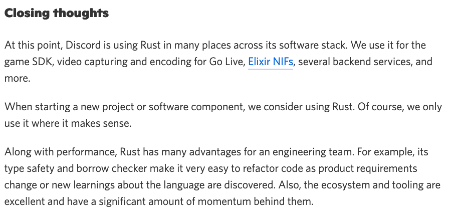

---

# Rust's strong points

I believe Rust is the best choice when...

* performance 
* reliability
* long-term maintenance

...are your top considerations.

???

Rust shines when you are trying to build core software. In my view, if you are working on something that needs to be very reliable, very fast, and which you will maintain for a long time, then I believe Rust is your best choice.

---

.p20[] says:

.text200["A stitch in time saves nine."]

???

To put another way, Rust is great choice for projects where you really want to get it right, and you're willing to put in the time for that.


---

# Why *not* use Rust?

* Existing systems
* Learning curve
* Cognitive overhead

???

But there are still good reasons not to use Rust. 

---

# Rust 2024

# Example: Discord's "read states" service



???

Actually, there's something else I want to highlight. At the end of their post, the Discord folks wrote this.

--

.wheremakessense[]

???

In particular, this paragraph: "when starting a new project, we consider using rust, but of course we only use it where it makes sense."

Based on what I've told you so far, you might have gotten the impression that Rust is always the best language to use. After all, I told you that you can get massive performance wins while maintaining high productivity. 

In truth though, even I, Rust partisan that I am, would not claim Rust is the best fit for all projects. An awful lot of them, yes, but not all.

---

# Where *does* it make sense to use Rust?

???

In my view, if you care about these 3 things, then Rust is the best choice, hands down. We can actually see all of these in the stories I gave.

*Performance* is obviously a key consideration for everyone.

*Reliability* 

*Long-term maintenance* 

---

.p20[] says:

.text200["A stitch in time saves nine."]

???

To put another way, I think Rust is great choice for projects where you really want to get it right, and you're willing to put in the time for that.

---

## Why not Rust?

* Existing system
* Learning curve
* Cognitive overhead

---

## Existing system

???

The most obvious. If you've got existing code in some other language, integrating Rust isn't always easy. You have to find some kind of seamless boundary. It requires your team to know more than one language. There are good techniques here, but it is often not the right overall choice.

---

## Learning curve

Most folks take 3-6 months to feel productive in Rust.

???

There's no denying it, learning Rust definitely takes time. I think it's worth the investment, but it's going to take some time. Why is that?

---

## Learning curve: new patterns

???

Part of it is that Rust requires learning some new patterns. This is the best part of the learning curve, 
because these patterns help to make code bug-free in all languages. The major difference is that in Rust 
you have compiler assistance.

---

## Learning curve: compiler and language limitations

???

But part of it is something else.

---

## Cognitive overhead


* **Rough learning curve**

???

The most common reason people give you is the learning curve. There's no getting around it, learning Rust takes time!

---

## Rough learning curve

Combination of a few factors

* New concepts
* Materials and techniques
* Incomplete language features

---

## Why not Rust?

* Rough learning curve
* **Cognitive overhead**

???

The other reason is interesting. I'm going to call it *cognitive overhead*.

---

## Cognitive overhead

Rust makes you care about

* performance
* reliability
* long-term maintenance

...and you don't always want to.

???

It's kind of the flip side of Rust's strength. Rust 

---

## Care about performance

Rust has two reference-counted types:

* `Rc<T>`: reference counted
* `Arc<T>`: *atomic* reference counted

???

Let's give an example where Rust makes you care about performance, but maybe you don't want to:
reference counting. If you're not familiar with reference counting, it's a simple way to figure
out when some piece of data is ready to be freed. The idea is to have a counter. Each time you give
access to the data to a new part of the program, you increment the counter. Each time you are finished
with it, you decrement the counter. When it reaches zero, you can free the data.

If you've used Objective C, reference counting will be familiar. If you've used Swift, you're likely also 
using reference counting, though "under the hood".

It turns out, though, that there's a subtle detail about reference counting that you've maybe *not*
been exposed to. When you go to increment a reference count, there are actually multiple ways to do it -- and the *fastest* way is not safe if that reference count might be adjusted by multiple threads at once. 
If you want something to be correct across threads, you need to use *atomic* arithmetic, which is slower.

Most systems just use atomic reference counts and be done with it. Rust offers you the choice -- moreover, we
check that you keep the two straight, and that you don't send a reference-counted value across threads unless
it is atomic. On the one hand, this is great, and it's part of how Rust performs tend to perform better. 

On the other hand, the performance difference here is pretty small most of the time, maybe not even measurable.
If you're writing networking code, it's quite possible that it's not significant to you compared to the I/O
latencies. But every Rust user has to know and think about it.

---

## Care about reliability

What does this Python code do?

```python
with open('README.md') as f:
    data = f.readlines()
    print(data);
```

???

If you said "reads the contents of readme.txt", you're right, but only partially.
Because you might wonder, what happens if `README.md` doesn't exist? The answer of
course is that it throws an exception, and we can't really tell what will happen.

---

## Care about reliability

Equivalent code in Rust:

```rust
fn main() {
    let data = std::fs::read_to_string("README.md");
    println!("{data}");
}
```

???

Here is some equivalent code in Rust. Not too shabby, right? But wait, what happens if I try it. Well, the code 

---

```rust
fn main() {
    let data = std::fs::read_to_string("README.md");
    println!("{data}");
}
```

yields

```md
error[E0277]: `Result<String, std::io::Error>` doesn't implement `Display`
 --> src/main.rs:3:16
  |
3 |     println!("{data}");
  |                ^^^^ `Result<String, std::io::Error>` cannot be
  |                     formatted with the default formatter
```

???

What is this error? Well, it turns out that the value `read_to_string`
returns isn't just a `String`. It's something called a `Result`,
which a way of signalling that this result could be an error.

---

## Care about reliability

Equivalent code in Rust:

```rust
fn main() -> Result<(), Box<dyn std::error::Error>> {
    let data = std::fs::read_to_string("README.md").unwrap();
    println!("{data}");
}
```

---

## Care about performance

```rust
let v = Box::new(vec![1, 2, 3]);
```

---

## Rust is evolving

.p200[]

---

## Rust 2015

.p200[]

---

## Rust 2018

.p200[]

---

## Rust 2021

.p200[]

---

## Rust 2024

???


---

# Building on our strengths

Some areas where Rust is doing especially well:

* Networking
* Embedded, kernel

---

# Rust in networking, circa 2018

```rust
async fn process_connection() {
    something().await;

    tokio::spawn(async move { ... })
}
```

---

# Rust in networking, circa 2021

* Async fn enables lightweight tasks and a natural coding style...
    * ...but support is missing from many areas of the language, like traits, closures, async-drop.

--

Closing the gap requires a number of crates and tools:

* `async_trait` proc macro
* `futures` crate combinators
* ...and some things, like async drop, just don't work.

---

# Rust in networking, circa 2024

* Async functions everywhere:
    * Traits, closures, and `AsyncDrop`

---

template: async-fn-everywhere

```rust
trait AsyncIter {
    type Item;

    async fn next(&mut self) -> Option<Self::Item>;
}
```

---

template: async-fn-everywhere

```rust
impl AsyncDrop for DatabaseConnection {
    async fn drop(&mut self) {
        self.send_close_message().await;
    }
}
```


---

# Rust in networking, circa 2021

* Great networking runtimes like tokio, async-std, glommio, embassy, fuschia...
    * ...but no mechanism for interop, leading to a lack of widely used libraries as well as surprising failures.

--

Closing the gap is hard:

* Most folks just limit themselves to tokio, but others try to roll their own traits.

---

# Rust in networking, circa 2021

* Rust developer tooling like cargo, rust-analyzer, rustup is excellent...
    * ...but relatively limited options to debug/profile/test applications, especially async ones.

--

Closing the gap is hard:

* Standard debuggers and C++ tools like perf work "ok" with sync Rust, but don't understand async at all
* Some bright lights, like [tokio console]

[tokio console]: https://github.com/tokio-rs/console

---

name: async-fn-everywhere


---

template: async-fn-everywhere

An open question:

* Can we do better than `AsyncIter` and `AsyncDrop`?
    * Idea: some way to have `async` variations of traits, currently under exploration.

[Learn more.]()

---

name: interop-traits

# Rust in networking, circa 2024

* Traits for interoperability:
    * Async read, write, spawning tasks

---

template: interop-traits

---

# Async fn everywhere

Building this requires:

* Improving the core compiler support:
    * Extending `impl Trait` support to...
        * support `-> impl Trait` in traits
        * support `type MyFuture = impl Future` type aliases
    * Extending associated types to...
        * support generic parameters `type Foo<'a>`

[Learn more.]()

---


---

# Rust in networking, circa 2024

* Improved operator tooling:
    * Gather metrics, integrate with debuggers, etc

--

Building this requires:

* Improving Rust's debuginfo and other information
* Extending runtimes
* Settling on common logging mechanisms etc

[Learn more.]()

---

# Async functions everywhere

```rust
trait AsyncIter {
    type Item;

    async fn next(&mut self) -> Option<Self::Item>;
}
```

---

# Rust in embedded and kernels, circa 2015


---

# Rust in embedded and kernels, circa 2021

---

# Rust in embedded and kernels, circa 2024


