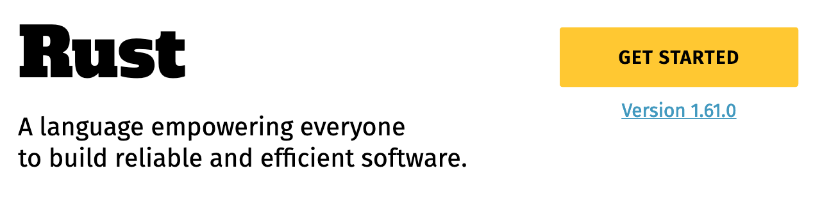
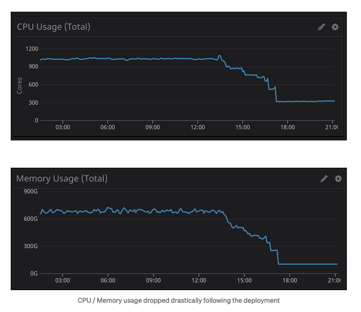

class: center
name: title
count: false

# Rust 2024

.p60[]

.me[.grey[*by* **Nicholas Matsakis**]]
.left[.citation[View slides at `https://github.com/nikomatsakis/skillsmatter2022/`]]

---

# Who is this guy

.text300[👋🏽 Hi!]

---

# Me

.p20[]

* Been working on Rust since 2011
* Co-lead of the Rust language design team

---

# Rust sprouting up all over


... and those are just the foundation platinum sponsors.

---

# What are people doing with Rust?

All kinds of things...

* Networking
* Embedded development
* Kernels, kernel modules
* Blockchain
* CLI apps (ripgrep, just, tokei, ...)
* ...and much more

---

# Why work on Rust?

???

Why work on Rust for so long?

Do I just hate garbage collectors?

--


???

No, though I do think they have a tendency to make a mess.

---

# Why work on Rust?

???

I love Rust because I like to see people cool stuff, and Rust is great at that.

--



???

It's right there on our page: Rust is a tool for helping everyone to build
reliable and efficient software. And what could be more rewarding than that?

There's a lot packed into this To start with, the phrase *empowering everyone*
refers to the fact that Rust aims to broaden the pool of people doing systems
programming. We want to get past the idea of *systems programming wizards* and build
an accessible tool that can be used by anybody who needs to build a fast, reliable
program. Interestingly, while a lot of Rust's users have a background in C++, there are
also a number of people who jump to Rust from higher-level languages like Python, JavaScript,
or Go, and we're proud of that.

---

# What's Rust's secret sauce?

???

So, if Rust is a tool for empowerment, it's natural to wonder-- how does it do that?

--

A strict and unforgiving type system!

???

The answer is our **type system**.

--


???

This can be a bit surprising, I know. 

Type systems don't always have a reputation as empowering. 

---

# Rust's type system == spinach


.citation[Image credit: [Clyde Robinson](https://flickr.com/photos/crobj/3184283013/)]

???

To many people, a type system feels a bit like spinach. A vegetable that you eat because you know it's healthy, but you don't actually enjoy. I actually agree with the first part: type systems *are* like spinach....

(True fact: I actually really like spinach, if properly prepared.)

---

# Rust's type system == POPEYE spinach

.p80[]

.citation[Image credit: [Mike Mozart](https://flickr.com/photos/jeepersmedia/17331456031/)]

???

...but it's popeye spinach. A good type system gives you a scaffolding and structure that lets you build
programs you can rely on. It lets you go from "this ought to be easy" to code that works with confidence.

---

# Example: Mozilla and Stylo


???

Let me give you an example, one that comes from Mozilla. Mozilla is the company where Rust was created, of course, and I worked there for a long time. (I'm at AWS now.) Mozilla makes Firefox, the famous browser. A key part of a browser, of course, is the CSS styling system. If you're familiar with CSS, you know that the idea is to traverse the HTML and to determine how big each piece of text should be, whether it should be bold, where it should appear, etc.

--


.opened[]

???

So about 12 years ago, it was recognized that this could be done in parallel. In fact, it's an "embarassingly parallel" problem, which means that there is no coordination needed between the threads. Should be easy, though bz. If you know bz, you'll know the guy is a genius. He knows Firefox inside and out. If you read the thread, though, you'll see that not one but two distinct attempts were made in C++ over the years, and neither was successful. Each of them fell prey to various problems: some of them were bugs in the parallel logic, some of them were small variations between windows, mac, and linux that made the code not work, etc. At the end of the day, people felt that the benefits of the patch were not worth the maintenance burden of landing it.

--


.closed[]

???

The 3rd and final attempt used Rust, and had the codename stylo. This version landed -- though it too was a non-trivial effort, don't get me wrong! Using Rust helped to give the team confidence that they could not only make the code work, but they could maintain it over time. For one thing, the Rust type system helped them to find bugs and logic errors at compilation time, instead of having to test the heck out of the thing. So this was a clear case where Rust enabled the team, a group of hardened C++ experts, to do something they had not been able to achieve before.

---

# Example: Tenable's metrics


.citation[[Tenable blog post from 2021-05-06]((https://medium.com/tenable-techblog/optimizing-700-cpus-away-with-rust-dc7a000dbdb2)]

???

I want to give another example, this time coming from the other direction. Tenable describes their experiences porting a service from JavaScript, using node.js, to Rust.

---

# Example: Tenable's metrics



.tenable1[]

.tenable2[]

???

It probably won't shock you to learn that Rust was faster. Quite a bit faster! These charts show the amount of memory and CPU time used to process requests, and you can clearly see the point where they switched from JS to Rust. Performance, of course, means a more responsive web page, but it also means far lower costs.

Of course, the fact that Rust beats JavaScript on performance isn't exactly surprising. JavaScript is after all a dynamically typed language with a JIT compiler. But you'd probably think that building the Rust service was probably really difficult.

---

# Example: Tenable's metrics

> With this small change, we were able to optimize away over 700 CPU and 300GB of memory. **This was all implemented, tested and deployed in a single sprint (two weeks).** Once the new filter was deployed, we were able to confirm the resource reduction in Datadog metrics.

???

Well, take a look at this paragraph from that same post. This was actually a plain vanilla Rust service,
and standing it up was not particularly difficult.

---

# Design goals for Rust

| | |
| --- | --- |
| ⚙️ Reliable | "If it compiles, it works" |
| 🐎 Performant | "idiomatic code runs efficiently" |
| 🥰 Supportive | "the language, tools, and community are here to help" |
| 🧩 Productive | "a little effort does a lot of work" |
| 🔧 Transparent | "you can predict and control low-level details" |
| 🤸 Versatile | "you can do anything with Rust" |

.citation[Caveat: These are goals that some of us drafted, not official design goals of the Rust project.]

---

# Example: Discord's "read states" service


.citation[[Discord blogpost from 2022-02-04](https://discord.com/blog/why-discord-is-switching-from-go-to-rust)]

???

I want to give one more example, this time from Discord. Like Tenable, Discord ported a service to Rust, this time starting from Go.

---


# Example: Discord's "read states" service


.gcpause[]

.rustperf[]

???

Like Tenable, Discord ported a service to Rust, this time starting from Go. Also like Tenable, they got some nice performance wins from doing so. The full post is worth a read, they talk about how, now that they no longer have to worry about garbage collection latency, 

I want to give one more example, this time from Discord. Like Tenable, Discord ported a service to Rust, this time starting from Go. Also like Tenable, they got some nice performance wins from doing so. The full post is worth a read, they talk about how, now that they no longer have to worry about garbage collection latency, 

In fairness to Go, I do want to say that they've made many improvements to their garbage collector since this post was written, and the measurements no doubt look different now. Nonetheless, I do believe that if you want rock-solid, flat, reliable performance, Rust is where it's at.

---

# Example: Discord's "read states" service

> We no longer had to deal with garbage collection, so we figured we could raise the cap of the cache and get even better performance. (...) The results below speak for themselves. **Notice the average time is now measured in microseconds and max @mention is measured in milliseconds**.

???

To me, the most interesting part of the post comes a bit later. Here, Rust allowed them to make further tweaks to their setup, resulting in even bigger gains. This is a pattern that we've seen before, and it aligns perfectly with one of Rust's slogans.

---

# Hack without fear

Rust lets you build (and maintain!) the systems you want to build.

???

---

# Rust 2024

So where do we go from here?

---

# Rust at the start

.p200[]

.citation[Artist: Daphne Matsakis]

???

When Rust first started, it wasn't clear what it should be. I think of it a bit like that famous quote about making a statue, where the idea is to look at some rock and see what is inside. I asked my daughter to draw some pictures the process, and this is the first one she drew.

---

# Rust 1.0 released in 2015

.p200[]

.citation[Artist: Daphne Matsakis]

???

In May of 2015, we released Rust 1.0. At that point, the shape of Rust had become fairly clear, but there were still a lot of details to work out. Our goal with this release was to signal to people: Rust is ready for production use. 

---

# Rust 2018

.p200[]

.citation[Artist: Daphne Matsakis]

???

Over the next few years, Rust picked up steam. As we gained experience, we started to see some "rough edges" that could be improved. There were a number of corner cases where we thought "if we could just tweak how this worked, we could make Rust a lot better for everyone" -- but we didn't want to break anybody's code, particularly after we had promised stability with 1.0.

Our solution was Rust editions. The idea is that, approximately every 3 years, we release a new Rust edition that contains a few changes that would otherwise be backwards incompatible. The trick is that the Rust compiler supports all editions -- the old and the new. To take advantage of the new features, you can opt-in to the new edition, and we even have tooling that will help migrate your code for you.

This way, new code immediately gains the benefit of the new edition. Old code continues to work and can migrate over to the edition at any time.

---

# Rust 2021

.p200[]

???

We released our second edition, Rust 2021, at the end of the last year. By this point, Rust's strong points -- and weak points -- are becoming quite clear.

---

# Rust 2024...?

--

Uh, I don't know. Nodody does, not yet.

---

# Where we are

* If performance and reliability are your top considerations:
    * Rust is your best choice


* If ease of iteration is your top priority:
    * Use a GC'd language like Python, Java, or Go

???

This is where we are today. For projects that really need top-notch performance and reliability, people are increasingly choosing Rust. 

But for projects where

---

.p20[] says:

.text200["A stitch in time saves nine."]

???

And honestly, that makes sense. Rust is oriented at surfacing problems early. This makes Rust a great choice for projects where you really want to get it right, and you're willing to put in the time for that. 

But if you'd rather be able to quickly modify code and not spend the time to get everything else in sync, it's not going to be a good choice for you.

---

# Where we are

* If performance and reliability are your top considerations:
    * Rust is your best choice


* If ease of iteration is your top priority:
    * Use a GC'd language like Python, Java, or Go


* **But what about the software in the middle?**

---

# Rust 2024

I think we want a combination of

* Building on our strengths
* Addressing our weaknesses
* Think big opportunities

---

# Building on our strengths

Rust is doing really well in several areas:

* Networking
* Embedded systems, IoT
* Kernels, core architectural layers

---

# Rust in networking, circa 2018

```rust
async fn process_connection() {
    something().await;
}
```

---

# Rust in networking, circa 2021

* Async fn enables lightweight tasks and a natural coding style...
    * ...but support is missing from many areas of the language, like traits, closures, async-drop.

---

# Rust in networking, circa 2021

Closing the gap requires a number of crates and tools:

* `async_trait` proc macro (shown below)
* `futures` crate combinators
* ...and some things, like async drop, just don't work.


```rust
#[async_trait]
trait AsyncIterator {
    type Item;

    async fn next(&mut self) -> Option<Self::Item>;
}
```

---

# Rust in networking, circa 2021

* Async fn enables lightweight tasks and a natural coding style...
    * ...but support is missing from many areas of the language, like traits, closures, async-drop.

--

* Great networking runtimes like tokio, async-std, glommio, embassy, fuschia...
    * ...but no mechanism for interop, leading to a lack of widely used libraries as well as surprising failures.

--

* Rust developer tooling like cargo, rust-analyzer, rustup is excellent...
    * ...but relatively limited options to debug/profile/test applications, especially async ones.

---

# Rust in networking, circa 2024

* Async fn can be used everywhere: traits, closures, drop
* Rich, interoperable library ecosystem
* Tooling like [tokio console] to analyze and debug neworked applications
* Works on servers as well as bare-metal environments

[tokio console]: https://github.com/tokio-rs/console

---

# How do we get there?

[Async vision doc](https://rust-lang.github.io/wg-async/vision.html) lays out a few key areas:

* Core compiler support for async functions in traits
* Traits for interoperability (read, write, spawn, etc)
* Polish, diagnostics, tooling support

Would you like to help? [Join `#wg-async` on rust-lang Zulip](https://rust-lang.zulipchat.com/#narrow/stream/187312-wg-async).

---

# Building on our strengths

* Networking:
    * Async vision doc


* Embedded, IoT, kernels:
    * Stabilize Rust features that give control over low-level details
    * Take advantage of custom details about a given platform


* General:
    * Rules and tools for unsafe code

---

# Rust 2024

I think we want a combination of

* Building on our strengths ✅
* **Addressing our weaknesses**
* Think big opportunities

---

# Addressing our weakenesses

Rust has some challenges:

* Learning curve
* Cognitive overhead

---

# Journey to loving Rust

Most folks take 3-6 months to learn Rust.

At first, it's ridiculously frustrating.

At some point, you turn the corner, and -- for many of us -- it's hard to imagine using another language.

---

# Key to loving Rust

Learning to *leverage* the Rust type system instead of *fighting* it.

Rust is pushing you towards new patterns. Those patterns are hard to learn, but they are (usually) beneficial.

---

# Detours

But not everybody comes to love Rust. 

Some 20% of people on the Rust survey use Rust daily and yet say they "struggle" to be productive.

Why?

---

# Why do people struggle?

Think back to the statue:

.p60[]

**Inherent** vs **accidental** complexity

???

The way I see it, there are two core reasons people struggle with Rust. The
first is inherent: Rust forces a certain rigor onto your work, and that can make
it more complex. That's often useful, but not always, since sometimes the things
that Rust is forcing you to be rigorous about are not that interesting. More on that
in a second.

But there's another source of complexity too -- more accidental. These are places 
where the core concept Rust is enforcing isn't the problem, more the way that
Rust enforces it, which will always be imperfect. 

I tend to think of inherent complexity as that status inside the stone -- or perhaps
even better than that, the image of the statue that I have in my mind.

The accidental complexity is both the stone left unchiseled but also the mistakes
that come out in the statue itself.

---

name: code-example

# Inherent vs accidental complexity

```rust
fn get_lazy(list: &mut Vec<String>) -> &mut String {
    if let Some(s) = list.first_mut() {
        return s;
    }

    list.push(format!("Hello, world!"));
    list.first_mut().unwrap()
}
```

---

template: code-example

.option[]

Inherent complexity: Representing many possibilities

Accidental complexity: `Option` types, `if let` vs `match`

???

Here's an example we can use to explore this idea a bit. This is a function
that, given a list, returns a mutable reference to the first item. If the
list is empty, it first pushes a dummy item and returns that.

There's a lot of Rust in this example. For example, you can see the `Option` type here.
This is Rust's answer to null pointers, borrowed from ML and many other 
functional languages. 

The ability to create enums -- data types that can be one of many alternatives -- is
a key part of how Rust models target domains, and it's one of those features that
everybody loves.

It's also part of how Rust achieves reliability: if you want to have something
be nullable, you have to say so explicitly.


---

template: code-example

.and-mut[]

Inherent complexity: Mutability xor sharing, pointers and references

Accidental complexity: `&mut` syntax

???

`&mut` references are a key part of Rust. 

The idea is that when you create a reference, you gain unique access to that data
for as long as the reference runs. 

This *concept* I think is inherent complexity. It forces a certain style onto Rust code that takes a while to get used to. 

But the details of how Rust realizes it, those can often be accidental.

---

template: code-example

.ret-ref[]

Inherent complexity: Returning a derived reference

Accidental complexity: Lifetime elision

???

As a simple example, this type signature indicates that the function will return
a reference, and moreover that the return will come from the input. This is because
of Rust's rules called "lifetime elision". 

--

```rust
fn get_lazy<'a>(list: &'a mut Vec<String>) -> &'a mut String
```

---

template: code-example

.polonius1[]

Accidental complexity: This code doesn't build!

* `s` was returned from the function, so `s` is borrowed for the rest of the function

???

But the reason I wanted to show you this example is because, in fact, it doesn't
compile, although arguably it should. Why not? The problem is a limitation of
our analysis. When you return a reference, as we do here, the compiler considers
that reference to hold for the entire rest of the function.

---

template: code-example

.polonius2[]

* `s` was returned from the function, so `s` is borrowed for the rest of the function
* `s` came from `list`, so `list` is borrowed for the rest of the function too

???

Since `s` came from `list`, that means that we borrow `list` and don't permit
anyone to use it.

---

template: code-example

.polonius3[]

* `s` was returned from the function, so `s` is borrowed for the rest of the function
* `s` came from `list`, so `list` is borrowed for the rest of the function too
* so `push` is illegal

[Try it out](https://play.rust-lang.org/?version=stable&mode=debug&edition=2021&gist=04de40f1c3a8805c105821b91ef9fb88)

???

Which means we get an error here, when you call `push`.

---

# Workaround

```rust
fn get_lazy(list: &mut Vec<String>) -> &mut String {
    if !list.is_empty() {
        let s = list.first_mut().unwrap();
        return s;
    }

    list.push(format!("Hello, world!"));
    list.first_mut().unwrap()
}
```

.polonius4[]

Workaround: move borrow inside the if

???

As it happens, you can rewrite this program like so, and it will work.

How would you know that this is the fix? This code is definitely worse than the previous code. What's worse, if you wrote the old code, expecting it to compile, you would like feel like you didn't understand Rust when you can't figure out why it's getting an error.

This is accidental complexity. As it happens, we know the fix -- there's a new analysis called polonius that we've been working on, and it would accept the original program. 

---

# Reducing accidental complexity

* Language changes like polonius, implied bounds
* Better environments and materials for learners:
    * Visualize Rust rules
    * Teach borrow checker patterns

---

# Rust 2024

I think we want a combination of

* Building on our strengths ✅
* Addressing our weaknesses ✅
* **Think big opportunities**

---

# Cognitive overhead

Rust makes you care about

* performance
* reliability
* long-term maintenance

...even when you don't want to.

---

# Example: Interfaces

Compare:

```rust
trait Iterator {
    type Item;

    fn next(&mut self) -> Option<Self::Item>;
}
```

with

```java
interface Iterator<E> {
    bool hasNext();
    E next();
}
```

???

Notice the `&mut self`. When you design a Rust interface, you say up front if you will be mutating the data in the receiver. This is cognitive overhead, but it's -- I believe -- the intrinsic kind.

---

# Example: Rc vs Arc

Rust has two reference-counted types:

* `Rc<T>`: reference counted -- faster
* `Arc<T>`: *atomic* reference counted -- works across threads

Which should you use?

???

This is harder, because there is a legitimate tradeoff here. When I worked at Mozilla, for example, folks lamented the fact that they used atomic reference counting throughout their C++ codebase. This was a cost they could never remove -- they'd never be able to get all the bugs out.

Rust changes the game here. It's plausible to use `Arc` everywhere and then change to `Rc` where you think it makes sense. The compiler will catch you if you get it wrong.

But you still have to know about it, and it still infects APIs. This is hard.

---

# Example: Async vs not

Earlier we talked about async:

```rust
trait AsyncIterator {
    type Item;

    async fn next(&mut self) -> Option<Self::Item>;
}
```

Great to have `AsyncIterator` and `AsyncDrop`, but will we wind up with an `AsyncFoo` for every sync `Foo`?

???

Yet another choice you must make. Sync vs async.

---

# Think big

Rust is always looking for ways to **eliminate tradeoffs**:

* Can we find a third way that means you don't have to think about it?

---

# Helping people learn to love the borrow checker

What can we do to help people feel productive in Rust and to avoid getting stuck?

---

# Library with custom errors and lints

---

# Avoiding colors

Maybe instead of defining traits like `AsyncIterator`, we should have `async Iterator`.

Perhaps we can leveage the same mechanism for `const` (compile-time evaluation)?

[Reference.](https://github.com/rust-lang/lang-team/issues/162)

---

# Iterative tooling

What if `cargo test` could run tests even when there were compilation errors? 

Maybe even skip compiling code that it didn't need?

---

# Unsafe code

Can `cargo test` run and detect problems by default?

---

# Platforms

Could

```rust
#[cfg(unix)]
fn do_something_in_a_unix_way() { }
```

become

```rust
fn do_something_in_a_unix_way()
where
    std::Platform: Unix,
{
    ...
}
```

---

# Building Rust 2024

I don't exactly know what Rust 2024 will be like.

But I know it's going to be a community effort.

If you're interested in getting involved, take a look at some of the recent blog posts:

* [Compiler team ambitions](https://blog.rust-lang.org/inside-rust/2022/02/22/compiler-team-ambitions-2022.html)
* [Lang team roadmap for 2024](https://blog.rust-lang.org/inside-rust/2022/04/04/lang-roadmap-2024.html)
* [Library team aspirations](https://blog.rust-lang.org/inside-rust/2022/04/20/libs-aspirations.html)

---

# Rust 2024

* Building on our strengths:
    * Async and sync code working at par
    * Stabilize key low-level capabilities
    * Support unsafe code 

* Addressing our weaknesses:
    * Smarter analyses, less accidental complexity
    * Developer tooling, documented patterns

* Thinking big:
    * Now's the time!

