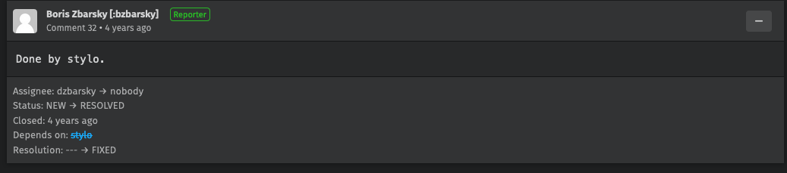
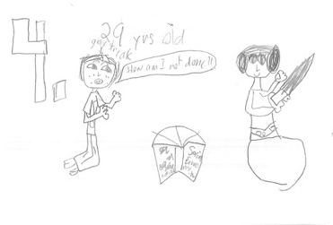

class: center
name: title
count: false

# Rust 2024

.p60[]

.me[.grey[*by* **Nicholas Matsakis**]]
.left[.citation[View slides at `https://github.com/nikomatsakis/skillsmatter2022/`]]

---

# Who is this guy

.text300[👋🏽 Hi!]

---

# Me

.p20[]

* Been working on Rust since 2011
* Co-lead of the Rust language design team

---

# Rust sprouting up all over


... and those are just the foundation platinum sponsors.

---

# What are people doing with Rust?

All kinds of things...

* Networking
* Embedded development
* Kernels, kernel modules
* Blockchain
* CLI apps (ripgrep, just, tokei, ...)
* ...and much more

---

# Why work on Rust?

???

Why work on Rust for so long?

Do I just hate garbage collectors?

--


???

No, though I do think they have a tendency to make a mess.

---

# Why work on Rust?

???

I love Rust because I like to see people cool stuff, and Rust is great at that.

--


???

It's right there on our page: Rust is a tool for helping everyone to build
reliable and efficient software. And what could be more rewarding than that?

There's a lot packed into this To start with, the phrase *empowering everyone*
refers to the fact that Rust aims to broaden the pool of people doing systems
programming. We want to get past the idea of *systems programming wizards* and build
an accessible tool that can be used by anybody who needs to build a fast, reliable
program. Interestingly, while a lot of Rust's users have a background in C++, there are
also a number of people who jump to Rust from higher-level languages like Python, JavaScript,
or Go, and we're proud of that.

---

# What's Rust's secret sauce?

???

So, if Rust is a tool for empowerment, it's natural to wonder-- how does it do that?

--

A strict and unforgiving type system!

???

The answer is our **type system**.

--


???

This can be a bit surprising, I know. 

Type systems don't always have a reputation as empowering. 

---

# Rust's type system == spinach


.citation[Image credit: [Clyde Robinson](https://flickr.com/photos/crobj/3184283013/)]

???

To many people, a type system feels a bit like spinach. A vegetable that you eat because you know it's healthy, but you don't actually enjoy. I actually agree with the first part: type systems *are* like spinach....

(True fact: I actually really like spinach, if properly prepared.)

---

# Rust's type system == POPEYE spinach

.p80[]

.citation[Image credit: [Mike Mozart](https://flickr.com/photos/jeepersmedia/17331456031/)]

???

...but it's popeye spinach. A good type system gives you a scaffolding and structure that lets you build
programs you can rely on. It lets you go from "this ought to be easy" to code that works with confidence.

---

# Example: Mozilla and Stylo


???

Let me give you an example, one that comes from Mozilla. Mozilla is the company where Rust was created, of course, and I worked there for a long time. (I'm at AWS now.) Mozilla makes Firefox, the famous browser. A key part of a browser, of course, is the CSS styling system. If you're familiar with CSS, you know that the idea is to traverse the HTML and to determine how big each piece of text should be, whether it should be bold, where it should appear, etc.

--


.opened[]

???

So about 12 years ago, it was recognized that this could be done in parallel. In fact, it's an "embarassingly parallel" problem, which means that there is no coordination needed between the threads. Should be easy, though bz. If you know bz, you'll know the guy is a genius. He knows Firefox inside and out. If you read the thread, though, you'll see that not one but two distinct attempts were made in C++ over the years, and neither was successful. Each of them fell prey to various problems: some of them were bugs in the parallel logic, some of them were small variations between windows, mac, and linux that made the code not work, etc. At the end of the day, people felt that the benefits of the patch were not worth the maintenance burden of landing it.

--



.closed[]

???

The 3rd and final attempt used Rust, and had the codename stylo. This version landed -- though it too was a non-trivial effort, don't get me wrong! Using Rust helped to give the team confidence that they could not only make the code work, but they could maintain it over time. For one thing, the Rust type system helped them to find bugs and logic errors at compilation time, instead of having to test the heck out of the thing. So this was a clear case where Rust enabled the team, a group of hardened C++ experts, to do something they had not been able to achieve before.

---

# Example: Tenable's metrics


.citation[[Tenable blog post from 2021-05-06]((https://medium.com/tenable-techblog/optimizing-700-cpus-away-with-rust-dc7a000dbdb2)]

???

I want to give another example, this time coming from the other direction. Tenable describes their experiences porting a service from JavaScript, using node.js, to Rust.

---

# Example: Tenable's metrics


.tenable1[]

.tenable2[]

???

It probably won't shock you to learn that Rust was faster. Quite a bit faster! These charts show the amount of memory and CPU time used to process requests, and you can clearly see the point where they switched from JS to Rust. Performance, of course, means a more responsive web page, but it also means far lower costs.

Of course, the fact that Rust beats JavaScript on performance isn't exactly surprising. JavaScript is after all a dynamically typed language with a JIT compiler. But you'd probably think that building the Rust service was probably really difficult.

---

# Example: Tenable's metrics

> With this small change, we were able to optimize away over 700 CPU and 300GB of memory. **This was all implemented, tested and deployed in a single sprint (two weeks).** Once the new filter was deployed, we were able to confirm the resource reduction in Datadog metrics.

???

Well, take a look at this paragraph from that same post. This was actually a plain vanilla Rust service,
and standing it up was not particularly difficult.

---

# Design goals for Rust

| | |
| --- | --- |
| ⚙️ Reliable | "If it compiles, it works" |
| 🐎 Performant | "idiomatic code runs efficiently" |
| 🥰 Supportive | "the language, tools, and community are here to help" |
| 🧩 Productive | "a little effort does a lot of work" |
| 🔧 Transparent | "you can predict and control low-level details" |
| 🤸 Versatile | "you can do anything with Rust" |

.citation[Caveat: These are goals that some of us drafted, not official design goals of the Rust project.]

---

# Example: Discord's "read states" service


.citation[[Discord blogpost from 2022-02-04](https://discord.com/blog/why-discord-is-switching-from-go-to-rust)]

???

I want to give one more example, this time from Discord. Like Tenable, Discord ported a service to Rust, this time starting from Go.

---


# Example: Discord's "read states" service


.gcpause[]

.rustperf[]

???

Like Tenable, Discord ported a service to Rust, this time starting from Go. Also like Tenable, they got some nice performance wins from doing so. The full post is worth a read, they talk about how, now that they no longer have to worry about garbage collection latency, 

I want to give one more example, this time from Discord. Like Tenable, Discord ported a service to Rust, this time starting from Go. Also like Tenable, they got some nice performance wins from doing so. The full post is worth a read, they talk about how, now that they no longer have to worry about garbage collection latency, 

In fairness to Go, I do want to say that they've made many improvements to their garbage collector since this post was written, and the measurements no doubt look different now. Nonetheless, I do believe that if you want rock-solid, flat, reliable performance, Rust is where it's at.

---

# Example: Discord's "read states" service

> We no longer had to deal with garbage collection, so we figured we could raise the cap of the cache and get even better performance. (...) The results below speak for themselves. **Notice the average time is now measured in microseconds and max @mention is measured in milliseconds**.

???

To me, the most interesting part of the post comes a bit later. Here, Rust allowed them to make further tweaks to their setup, resulting in even bigger gains. This is a pattern that we've seen before, and it aligns perfectly with one of Rust's slogans.

---

# Hack without fear

Build the systems you want to build.

???

---

# Rust 2024

So where do we go from here?

---

# Rust at the start

.p200[]

.citation[Artist: Daphne Matsakis]

---

## Rust 1.0 released in 2015

.p200[]

.citation[Artist: Daphne Matsakis]

???

In May of 2015, we released Rust 1.0.

---

## Rust 2018

.p200[]

.citation[Artist: Daphne Matsakis]


---

## Rust 2021

.p200[]


---

# Example: Discord's "read states" service


???

Actually, there's something else I want to highlight. At the end of their post, the Discord folks wrote this.

--

.wheremakessense[]

???

In particular, this paragraph: "when starting a new project, we consider using rust, but of course we only use it where it makes sense."

Based on what I've told you so far, you might have gotten the impression that Rust is always the best language to use. After all, I told you that you can get massive performance wins while maintaining high productivity. 

In truth though, even I, Rust partisan that I am, would not claim Rust is the best fit for all projects. An awful lot of them, yes, but not all.

---

# Where *does* it make sense to use Rust?

Programs where:

* performance 
* reliability
* long-term maintenance

are top considerations.

???

In my view, if you care about these 3 things, then Rust is the best choice, hands down. We can actually see all of these in the stories I gave.

*Performance* is obviously a key consideration for everyone.

*Reliability* 

*Long-term maintenance* 

---

.p20[] says:

.text200["A stitch in time saves nine."]

???

To put another way, I think Rust is great choice for projects where you really want to get it right, and you're willing to put in the time for that.

---

## Why not Rust?

* Existing system
* Learning curve
* Cognitive overhead

---

## Existing system

???

The most obvious. If you've got existing code in some other language, integrating Rust isn't always easy. You have to find some kind of seamless boundary. It requires your team to know more than one language. There are good techniques here, but it is often not the right overall choice.

---

## Learning curve

Most folks take 3-6 months to feel productive in Rust.

???

There's no denying it, learning Rust definitely takes time. I think it's worth the investment, but it's going to take some time. Why is that?

---

## Learning curve: new patterns

???

Part of it is that Rust requires learning some new patterns. This is the best part of the learning curve, 
because these patterns help to make code bug-free in all languages. The major difference is that in Rust 
you have compiler assistance.

---

## Learning curve: compiler and language limitations

???

But part of it is something else.

---

## Cognitive overhead


* **Rough learning curve**

???

The most common reason people give you is the learning curve. There's no getting around it, learning Rust takes time!

---

## Rough learning curve

Combination of a few factors

* New concepts
* Materials and techniques
* Incomplete language features

---

## Why not Rust?

* Rough learning curve
* **Cognitive overhead**

???

The other reason is interesting. I'm going to call it *cognitive overhead*.

---

## Cognitive overhead

Rust makes you care about

* performance
* reliability
* long-term maintenance

...and you don't always want to.

???

It's kind of the flip side of Rust's strength. Rust 

---

## Care about performance

Rust has two reference-counted types:

* `Rc<T>`: reference counted
* `Arc<T>`: *atomic* reference counted

???

Let's give an example where Rust makes you care about performance, but maybe you don't want to:
reference counting. If you're not familiar with reference counting, it's a simple way to figure
out when some piece of data is ready to be freed. The idea is to have a counter. Each time you give
access to the data to a new part of the program, you increment the counter. Each time you are finished
with it, you decrement the counter. When it reaches zero, you can free the data.

If you've used Objective C, reference counting will be familiar. If you've used Swift, you're likely also 
using reference counting, though "under the hood".

It turns out, though, that there's a subtle detail about reference counting that you've maybe *not*
been exposed to. When you go to increment a reference count, there are actually multiple ways to do it -- and the *fastest* way is not safe if that reference count might be adjusted by multiple threads at once. 
If you want something to be correct across threads, you need to use *atomic* arithmetic, which is slower.

Most systems just use atomic reference counts and be done with it. Rust offers you the choice -- moreover, we
check that you keep the two straight, and that you don't send a reference-counted value across threads unless
it is atomic. On the one hand, this is great, and it's part of how Rust performs tend to perform better. 

On the other hand, the performance difference here is pretty small most of the time, maybe not even measurable.
If you're writing networking code, it's quite possible that it's not significant to you compared to the I/O
latencies. But every Rust user has to know and think about it.

---

## Care about reliability

What does this Python code do?

```python
with open('README.md') as f:
    data = f.readlines()
    print(data);
```

???

If you said "reads the contents of readme.txt", you're right, but only partially.
Because you might wonder, what happens if `README.md` doesn't exist? The answer of
course is that it throws an exception, and we can't really tell what will happen.

---

## Care about reliability

Equivalent code in Rust:

```rust
fn main() {
    let data = std::fs::read_to_string("README.md");
    println!("{data}");
}
```

???

Here is some equivalent code in Rust. Not too shabby, right? But wait, what happens if I try it. Well, the code 

---

```rust
fn main() {
    let data = std::fs::read_to_string("README.md");
    println!("{data}");
}
```

yields

```md
error[E0277]: `Result<String, std::io::Error>` doesn't implement `Display`
 --> src/main.rs:3:16
  |
3 |     println!("{data}");
  |                ^^^^ `Result<String, std::io::Error>` cannot be
  |                     formatted with the default formatter
```

???

What is this error? Well, it turns out that the value `read_to_string`
returns isn't just a `String`. It's something called a `Result`,
which a way of signalling that this result could be an error.

---

## Care about reliability

Equivalent code in Rust:

```rust
fn main() -> Result<(), Box<dyn std::error::Error>> {
    let data = std::fs::read_to_string("README.md").unwrap();
    println!("{data}");
}
```

---

## Care about performance

```rust
let v = Box::new(vec![1, 2, 3]);
```

---

## Rust is evolving

.p200[]

---

## Rust 2015

.p200[]

---

## Rust 2018

.p200[]

---

## Rust 2021

.p200[]

---

## Rust 2024

???
